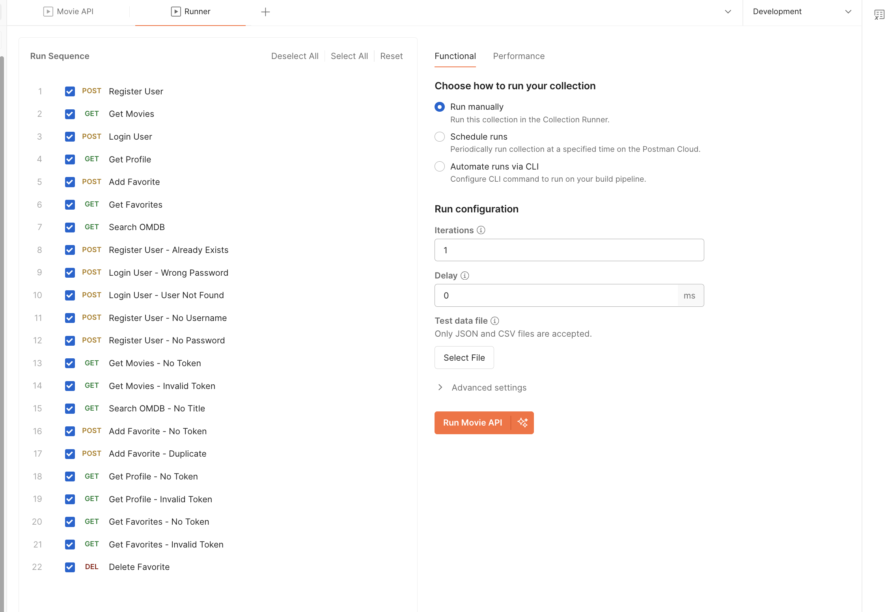
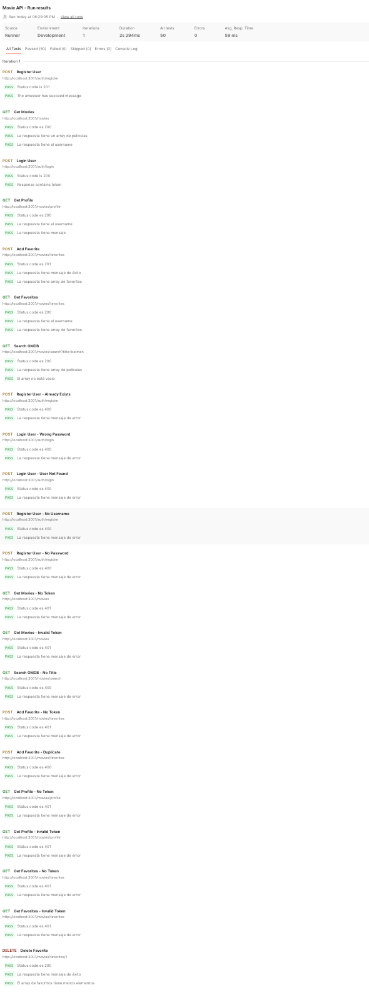

# Movie API 🎬 | Postman & Newman API Test Portfolio

[](https://github.com/MauricioSabajMorales/movie-api/actions/workflows/newman.yml)

REST API with JWT authentication for movie and favorites management, with a full API test automation suite built with Postman and Newman.

---

## 👨‍💻 About Me

QA Engineer with 3+ years of experience in software testing, including strong expertise in accessibility testing, especially on mobile platforms.

My background includes functional, exploratory, and accessibility validation, ensuring inclusive user experiences across devices.

Currently expanding into Automation Engineering with focus on:

- Postman & Newman API test automation
- CI/CD integration with GitHub Actions
- Playwright + TypeScript E2E automation
- AI Model Testing (in training)

My goal is to grow into a QA Automation / SDET role while combining automation, accessibility expertise, and modern testing practices.

---

## ✅ What This Project Validates

### Authentication
- Successful user registration (`201`)
- Login and automatic JWT token storage (`200`)
- Register with existing user returns error (`400`)
- Login with wrong password returns error (`400`)
- Login with non-existent user returns error (`400`)
- Register without username returns error (`400`)
- Register without password returns error (`400`)

### Movies
- Get movies list with valid token (`200`)
- Get movies without token returns `401`
- Get movies with invalid token returns `401`
- Search movies on OMDB by title (`200`)
- Search OMDB without title returns error (`400`)

### Favorites
- Add movie to favorites (`201`)
- Add duplicate movie returns error (`400`)
- Add favorite without token returns `401`
- Get favorites list (`200`)
- Get favorites without token returns `401`
- Get favorites with invalid token returns `401`
- Delete favorite (`200`)

### Profile
- Get user profile with valid token (`200`)
- Get profile without token returns `401`
- Get profile with invalid token returns `401`

---

## 🧰 Tech Stack

| Tool | Purpose |
|------|---------|
| **Postman** | Collection design, test scripting, environment management |
| **Newman** | CLI runner for local and CI execution |
| **newman-reporter-htmlextra** | HTML report generation |
| **GitHub Actions** | CI/CD pipeline — runs on every push to `main` |
| **Node.js + Express** | REST API under test |
| **JWT** | Authentication mechanism being tested |
| **OMDB API** | External API integration under test |

---

## 🏗️ Repository Structure
```
/postman
  /collections        # Postman collection (JSON)
  /environments       # Environment variables (dev)
/src
  /middleware         # Auth middleware
  /routes             # API routes
/reports              # Newman HTML reports (generated on CI)
/.github/workflows    # GitHub Actions CI workflow
.env.example          # Environment variables template
```

---

## 🔑 Key Testing Concepts Demonstrated

- **Pre-request scripts** — Dynamic random user generation before each test run
- **Post-response scripts** — Automatic JWT token extraction and storage
- **Environment variables** — `base_url`, `token`, `random_user` managed per environment
- **Collection variables** — Shared state across requests
- **Negative testing** — Auth failures, missing fields, duplicate entries, invalid tokens
- **Chained requests** — Register → Login → authenticated endpoints using stored token
- **pm.sendRequest()** — Pre-request HTTP call to set up test state (duplicate favorite test)

---

## 🚀 How to Run the Project (Quick Start)

### Prerequisites
- Node.js 18+ (20 recommended)
- npm
- Postman (optional, for manual runs)

### Installation
```bash
git clone https://github.com/MauricioSabajMorales/movie-api.git
cd movie-api
npm install
```

### Environment setup
```bash
cp .env.example .env
```

Fill in `.env`:
```
PORT=3001
JWT_SECRET=your_secret_here
OMDB_API_KEY=your_api_key_here
```

### Start the API
```bash
npm start
```

### Run tests with Newman
```bash
npm install -g newman newman-reporter-htmlextra

newman run postman/collections/movie-api.postman_collection.json \\
  --environment postman/environments/movie-api.postman_environment.json \\
  --reporters cli,htmlextra \\
  --reporter-htmlextra-export reports/newman-report.html
```

---

## 🤖 Continuous Integration

This project includes a GitHub Actions workflow that runs automatically on every push to `main`:

- Installs Node.js and dependencies
- Starts the API server with test credentials via GitHub Secrets
- Waits for the server to be ready
- Installs Newman and runs the full collection
- Generates and uploads an HTML report as a downloadable artifact

---

## 📊 Test Metrics

| Metric | Value |
|--------|-------|
| Total requests | 23 |
| Total assertions | 50 |
| Positive (happy path) tests | 7 |
| Negative tests | 16 |
| Endpoints covered | 8 |
| Auth scenarios | 10 |

---

## 📸 Screenshots

### CI Pipeline — All Tests Passing


### Newman Execution Output
